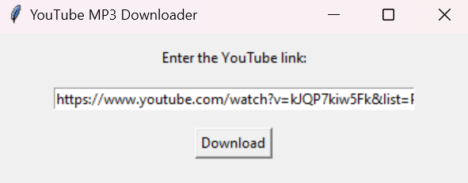
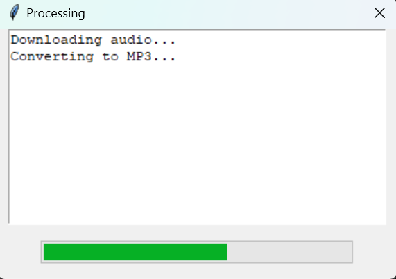
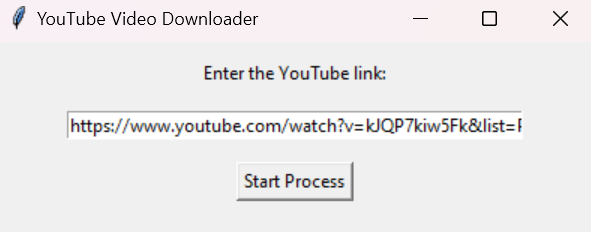
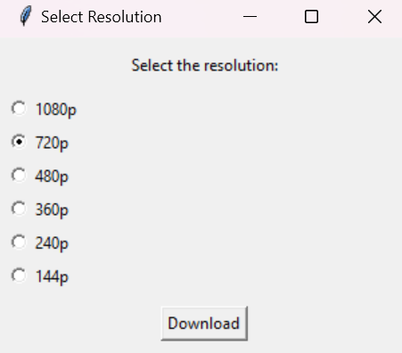
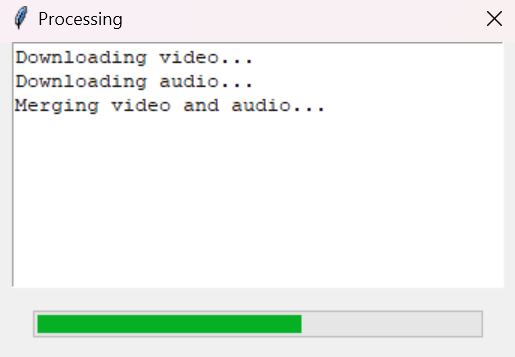
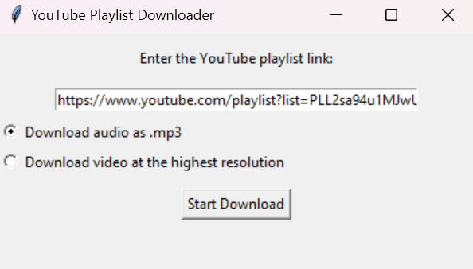
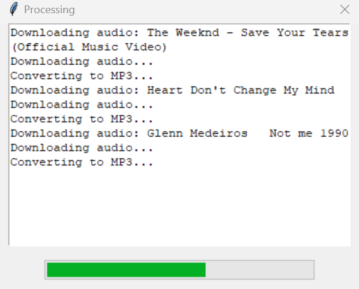

# YouTube Converter

## Description

The **YouTube Converter** is a powerful and easy-to-use desktop application designed to help users download videos, audio, and entire playlists from YouTube. With its intuitive graphical interface, users can quickly convert YouTube content to various formats, including MP3 for audio and MP4 for video, without needing any technical expertise. Whether you're downloading a single video or an entire playlist, the YouTube Converter handles everything in the background seamlessly.


---

## Features

- **Video Downloads**: Download YouTube videos in the highest available resolution.
- **Audio Downloads**: Convert YouTube videos to MP3 format and download them.
- **Playlist Downloads**: Download entire playlists in either audio or video formats.
- **Automatic Audio/Video Merging**: Uses FFmpeg to merge video and audio streams.
- **User-Friendly GUI**: Simplified, intuitive interface that requires no command-line interaction.
- **Standalone Executable**: No need to install Python or external dependencies—everything is bundled into one executable file.

---

## Requirements (For Development)

If you're working in development mode, you need to install some dependencies via `pip`. However, **FFmpeg is already included** in the project in a zipped format (`ffmpeg.zip`), so no need to install it manually. Simply unzip the `ffmpeg.zip` file as instructed below.

### Updated `requirements.txt`

```plaintext
pytubefix==7.3.0
```

### Explanation

- **`pytubefix`** is the only external library that needs to be installed because all other modules (like `tkinter`, `subprocess`, `os`, `threading`, etc.) are part of Python's standard library.
- You don't need to install **FFmpeg** separately, as it’s included in the project as `ffmpeg.zip`, which needs to be unzipped in both the `ffmpeg/` folder for development mode.

Install the required libraries using:

```bash
pip install -r requirements.txt
```

---

## Installation and Setup

### 1. **For All Users: Run `main.exe`**

Whether you're a regular user or developer, you can run the application without any additional setup. Just follow these steps:

1. **Download the Application**  
   Download the latest release from the [release page](https://github.com/Glooring/youtube-converter/releases/latest) or directly using [this link](https://github.com/Glooring/youtube-converter/releases/download/v1.0.0/youtube-converter-v1.0.0-release.zip).

2. **Unzip the File**  
   Extract the contents of the downloaded ZIP file.

3. **Run the Application**  
   Open the extracted folder and double-click `main.exe` to launch the YouTube Converter.

---

### 2. For Developers: Run the Project in Python

If you want to run the project in script mode for development purposes, follow the steps below:

1. **Download or Clone the Repository**  
   You can either download the entire project archive from the repository or clone it using the following command:
   ```bash
   git clone https://github.com/Glooring/youtube-converter.git
   cd youtube-converter
   ```

2. **Install Dependencies**  
   Install the required dependencies using `pip`:
   ```bash
   pip install -r requirements.txt
   ```

3. **Unarchive `ffmpeg.zip`**  
   Inside the project folder, navigate to the following path:  
   `helpers/ffmpeg/`.  
   You'll find a file named `ffmpeg.zip`. Unzip this file to ensure that `ffmpeg.exe` is available for the application to function properly.

   After unarchiving, the folder structure should look like this:

   ```
   YouTube-Converter/
   └── helpers/                     # Folder containing helper modules
       └── ffmpeg/                  # FFmpeg folder (for development mode
           └── ffmpeg.exe
   ```

4. **Run the Application**  
   Once the `ffmpeg.exe` is properly placed, you’re ready to run the application:  
   ```bash
   python main.py
   ```

---

## How to Use the YouTube Converter Project

### 1. Main Interface

Once the application is launched, you’ll see three options in the main interface:

- **Simple link to audio**: Download an audio file (MP3) from a YouTube video.
- **Simple link to video**: Download the preferred resolution video from a YouTube video link.
- **Playlist link**: Download an entire YouTube playlist as either audio or video, with videos in the highest available resolution. A list of all YouTube links and titles will be generated in the same folder where the files are downloaded.

   #### Example Screenshot:
   

---

### 2. Downloading Audio from a YouTube Video

1. **Click on "Simple link to audio"**: This opens a new window for audio download.
   
   #### Example Screenshot:
   
   
   
2. **Enter the YouTube video link**: Paste the YouTube link into the input field.
3. **Select the folder**: Choose where you want to save the MP3 file.
4. **Download progress**: A progress bar will show the download and conversion status.

   #### Example Screenshot:
   
   
   
5. **Completion**: Once complete, the MP3 file will be saved in the selected folder.

---

### 3. Downloading Video from a YouTube Link

1. **Click on "Simple link to video"**: Opens the video download window.

   #### Example Screenshot:
   
   

2. **Enter the YouTube video link**: Paste the video link.
3. **Select the folder**: Choose where to save the video file.
4. **Select the resolution**: Choose from available resolutions (e.g., 1080p, 720p).

   #### Example Screenshot:
   
   
   
5. **Download progress**: A progress bar will show the download and conversion status.

   #### Example Screenshot:
   
   

6. **Completion**: The video and audio streams are downloaded, merged, and saved as an MP4 file.

---

### 4. Downloading a YouTube Playlist

1. **Click on "Playlist link"**: This opens the playlist download window.

   #### Example Screenshot:
   
   

2. **Enter the playlist URL**: Paste the link of the playlist.
3. **Choose download type**: Select either MP3 (audio) or MP4 (video) for the entire playlist.
4. **Select the folder**: Choose where to save the playlist files.
5. **Download process**: The application downloads and processes each file in the playlist, showing progress for each.

   #### Example Screenshot:
   
   
   
6. **Completion**: Once complete, the Playlist folder will be saved in the selected folder.

---

## Project Structure

The project is divided into several components for better organization and modularity. The overall structure is:

```
YouTube-Converter/
│
├── helpers/                     # Folder containing helper modules
│   ├── ffmpeg/                  # FFmpeg folder (for development mode
│   │	└── ffmpeg.exe           # FFmpeg executable (unzip ffmpeg.zip here))
│   ├── token_file/              # Folder containing token configuration
│   │	└── token_file.json      # Stores API tokens for authentication and secure access  
│   ├── audio_helper.py          # Handles audio downloads and conversion
│   ├── video_helper.py          # Manages video downloads and resolution selection
│   ├── playlist_helper.py       # Handles playlist downloads (both video and audio)
│   └── utils.py                 # Utility functions (file sanitization, ffmpeg paths, etc.)
├── screenshots                  # Folder containing screenshots for the README
├── LICENSE                      # MIT License
├── README.md                    # Project documentation (this file)
├── main.py                      # Main script to launch the application
└── requirements.txt             # Python dependencies for development purposes
```

---

## Building the `main.exe` Executable

For developers interested in building the standalone executable (`main.exe`), we use **PyInstaller** to package the project. Below are the steps:

### 1. Organize the Project

Make sure the project structure is correct with all the necessary helper modules and dependencies.

### 2. Run PyInstaller

Use the following command to create the `main.exe` executable:

```bash
```
pyinstaller ^
  --onedir ^
  --name main ^
  --hidden-import=helpers.audio_helper ^
  --hidden-import=helpers.playlist_helper ^
  --hidden-import=helpers.video_helper ^
  --hidden-import=helpers.utils ^
  --add-data "helpers/token_file/token_file.json;helpers/token_file" ^
  --add-data "helpers/ffmpeg/ffmpeg.exe;helpers/ffmpeg" ^
  --noconsole ^
  main.py
```

> **Explanation:**  
> - The `--add-data` parameters ensure that both the **token_file.json** (for configuration/authentication) and the **ffmpeg.exe** (for multimedia processing) are bundled with the executable.  

---

## Technologies Used

- **Python 3.7+**: The primary programming language for the application.
- **pytube**: To interact with YouTube for downloading videos and playlists.
- **tkinter**: For creating the graphical user interface (GUI).
- **ffmpeg**: A multimedia tool for handling audio and video processing (bundled in the release).
- **ffmpeg-python**: Python wrapper for interacting with FFmpeg for video/audio merging.

---

## Contributing

Contributions are welcome! If you'd like to contribute:

1. **Fork the repository**.
2. **Create a new branch** (`feature/your-feature-name`).
3. **Make your changes**.
4. **Submit a pull request**.

---

## License

This project is licensed under the MIT License. See the `LICENSE` file for more details.

---

## Conclusion

The **YouTube Converter** is a powerful yet user-friendly tool that simplifies the process of downloading and converting YouTube content. Whether you’re downloading a single video, converting audio to MP3, or downloading entire playlists, the tool’s straightforward GUI makes it accessible to all users. With built-in FFmpeg support and the ability to run as a standalone executable, it's a versatile solution for managing YouTube downloads.